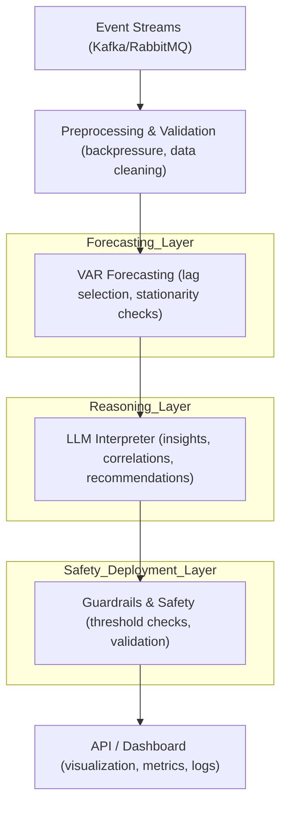

# Distributed Capacity Forecasting Platform

📖 **Case Study**

### **Problem**

Distributed systems face unpredictable traffic spikes and require accurate capacity planning to:

* Prevent outages
* Optimize resource usage
* Reduce latency

---

### **Approach**

* **Data Ingestion:** Real-time streaming events processed with validation and cleaning pipelines.
* **Forecasting Model (VAR):** Chosen for interpretability, multi-variate forecasting, and deterministic outputs.
* **LLM Reasoning:** Generates structured insights, correlates metrics, and provides recommendations.
* **Agentic Workflow:** Orchestrates forecasting, analysis, and safety checks, ensuring reliable automated reasoning.
* **Guardrails:** Validation layers prevent spurious forecasts and enforce threshold checks.

---

### **Decision Tradeoffs**

* VAR was preferred over LSTM for stability and interpretability.
* LLMs are used for reasoning only, not predictions, avoiding black-box behavior.
* Microservice architecture ensures modularity and scalability.

---

### **Iterative Improvements**

* Preprocessing pipelines include stationarity checks and missing data handling.
* Logs and metrics enable debugging and model validation.
* Future enhancements: automated model selection, dashboards, and ensemble forecasting.

---

### **Outcome**

* Modular, documented platform with safe LLM integration and reproducible forecasting results.
* Portfolio-ready showcase highlighting engineering rigor and practical reasoning.

---

## 🏗️ Architecture



---

## ⚙️ Tech Stack

* Python (microservices)
* Kafka (event streaming)
* Docker (containerization)
* REST APIs (service communication)

---

## 🔥 Key Features

1. **Real-time Streaming Pipeline**

   * Event-driven architecture using Kafka
   * Continuous data ingestion

2. **Anomaly Detection**

   * Detects unusual spikes in load
   * Helps catch failures or abnormal usage

3. **Demand Forecasting**

   * Predicts future capacity requirements
   * Enables proactive scaling decisions

4. **Fault Tolerance (Simulated)**

   * Retry mechanisms
   * Idempotent processing
   * Graceful failure handling

---

## 📊 System Metrics (Planned / Extendable)

* Throughput (events/sec)
* Latency (end-to-end processing time)
* Error rate
* Queue lag

---

## ⚠️ Failure Scenarios Considered

* Producer crash → recovery via message replay
* Consumer lag → backpressure handling
* Service failure → retry with exponential backoff

---

## 🧠 Design Decisions

* Event-driven architecture for scalability
* Loose coupling between services
* Eventual consistency for performance
* Partitioned streams for parallel processing

---

## 🚀 Getting Started

```bash
docker-compose up --build
```

---

## 📌 Future Improvements

* Add Prometheus + Grafana for observability
* Implement auto-scaling simulation logic
* Improve forecasting model (ML-based)
* Deploy on Kubernetes

---

## 💡 Why This Project

Demonstrates:

* Distributed systems design
* Stream processing
* Scalability tradeoffs
* Real-world system thinking

---

## 👤 Author

**Sowmyaa Dixit**
